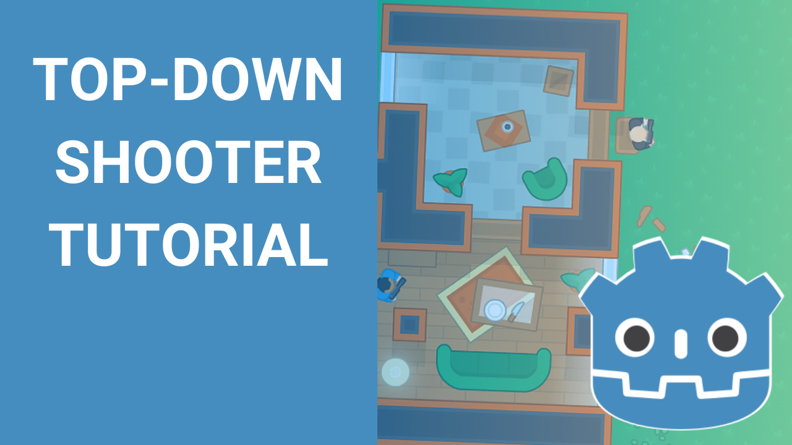

# Godot Top-down Shooter Tutorial
This repository contains the source code for the Godot Top-down Shooter Tutorial series.

[You can follow along with the series on YouTube.](https://www.youtube.com/watch?v=gXkkNSfxLRI&list=PLpwc3ughKbZexDyPexHN2MXLliKAovkpl&index=2&t=2s)

## How to Use This Repository

I make a separate commit at the end of each video in the series, so if you want to pull down the code at a specific point in the series you can find the specific commit for the video you want (I label each commit message with the video part) in the commits tab.

If there is a bug or issue with the code, feel free to open an issue here or reach out on the Discord server (Discord is preferable since I check it more, but I'll eventually see it here).

## Join our Community Discord

If you have questions about the tutorial or the code, or just want to connect with other developers, join our community Discord by following the link below.
I or another member will be happy to help and we have an active community of developers there. We'd love to have you!

[Click here to join our Discord.](https://discord.gg/e4BxZbe)

## Support my Work

If you've found this tutorial series helpful, please consider supporting my work by [buying me a coffee.](https://www.buymeacoffee.com/jmbiv)

Thanks so much for watching, and I hope you find these tutorials helpful! If you use them to make your own game, or just find some of the concepts I talk about helpful, I'd love to see updates on the projects you make - feel free to drop those in the Discord server.

